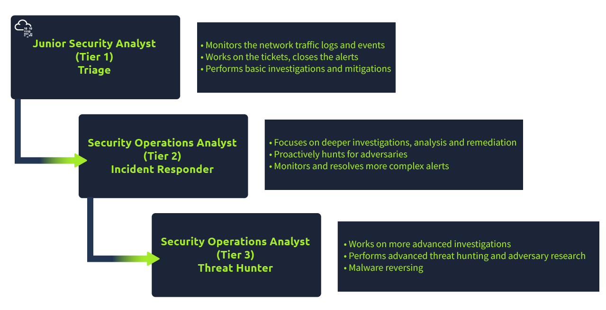
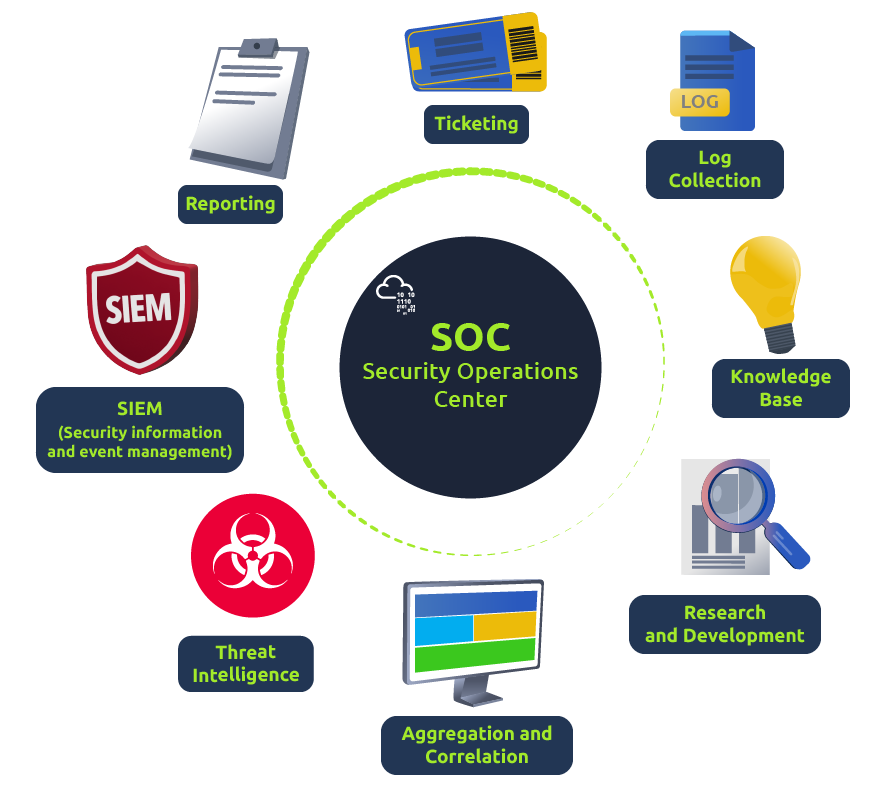

# Junior Security Analyst Intro Walktrhough

**Author:** David Boyd 
**Date:** 2024-02-18

## Table of Contents

<!-- vim-markdown-toc GFM -->

* [Objective](#objective)
* [Prerequisites](#prerequisites)
* [Task 1: A Career as a Junior (Associate) Security Analyst](#task-1-a-career-as-a-junior-associate-security-analyst)
  * [Walkthrough](#walkthrough)
    * [Question 1](#question-1)
* [Task 2: Security Operations Center (SOC)](#task-2-security-operations-center-soc)
  * [SOC Responsibilities](#soc-responsibilities)
  * [Preparation and Prevention](#preparation-and-prevention)
    * [SOC Personnel Responsibilities](#soc-personnel-responsibilities)
    * [Prevention Methods](#prevention-methods)
    * [Monitoring and Investigation](#monitoring-and-investigation)
    * [Response](#response)
  * [Walkthrough](#walkthrough-1)
    * [Question 1](#question-1-1)
* [Task 3: A day in the life of a Junior (Associate) Security Analyst](#task-3-a-day-in-the-life-of-a-junior-associate-security-analyst)
  * [Walkthrough](#walkthrough-2)
    * [Question 1](#question-1-2)
    * [Question 2](#question-2)
    * [Question 3](#question-3)
    * [Question 4](#question-4)

<!-- vim-markdown-toc -->

## Objective

Play through a day in the life of a Junior Security Analyst, their
responsibilities and qualifications needed to land a role as an analyst.

## Prerequisites

* Basic understanding of Networking
  * OSI mdoel
  * TCP/IP model
* OS
  * Windows
  * Linux
* Web Apps
* Bonus
  * Scripting/programming

## Task 1: A Career as a Junior (Associate) Security Analyst

### Walkthrough

#### Question 1

What will be your role as a Junior Security Analyst?

  
Expand for answer:
 

  * Answer: <strong>Triage Specialist</strong>
  * Explanation:

| Tier   | Title                       | Role               |
|--------|-----------------------------|--------------------|
| Tier 1 | Junior Security Analyst     | Triage Specialist  |
| Tier 2 | Security Operations Analyst | Incident Responder |
| Tier 3 | Security Operations Analyst | Threat Hunter      |

## Task 2: Security Operations Center (SOC)

SOC
: a center that functions to *investigate*, *monitor*, *prevent*, and
  *respond* to **threats**.

### SOC Responsibilities

### Preparation and Prevention

#### SOC Personnel Responsibilities

* Stay up-to-date with current cybersecurity threats
  * X/Twitter, [Feedly](https://feedly.com/homepage)
* Detect and hunt threats
* Work on a [security roadmap](https://www.mcafee.com/enterprise/en-us/security-awareness/cybersecurity/creating-cybersecurity-strategy.html)

#### Prevention Methods

* Gathering Intelligence Data:
  * Latest Threats
  * Threat Actors
  * TTPs
* Maintenance procedures
  * Updating FW signatures
  * Patching vulnerabilities in existing sytems
  * Block-listing & Safe-listing:
    * applications
    * email addresses
    * IPs

TTPs (Tactics, Techniques, and Procedures)
: the patterns of activities or methods associated with a specific threat actor
  or group of threat actors.

*Example:* [APT40 TTPs](https://us-cert.cisa.gov/ncas/alerts/aa21-200a)

#### Monitoring and Investigation

* SOC Security Tools:
  * SIEM
  * EDR
* Triaging Ongoing Alerts
  * Triaging Levels:
    * `Low` :arrow_right: `Medium` :arrow_right: `High` :arrow_right:
      `Critical`
  * During an Investigation:
    * Questions to ask:
      * *"How?"*, "*When?"*, and *"Why?"*
    * Answers can be found in:
      * data logs
      * alerts
      * OSINT tools

#### Response

The SOC team corrdinates and takes action on comprimised hosts:

* Isolating hosts from network
* Terminating malicious processes
* Deleting files
* Etc.

### Walkthrough

#### Question 1

Read the above.

  
Expand for answer: 

  <strong>Click `Completed`</strong>

## Task 3: A day in the life of a Junior (Associate) Security Analyst

A SOC analyst works with various: 
* Log Sources
  * Network Traffic
    * IPS alerts
    * IDS alerts
    * Etc.
  * Suspicious Emails
  * Data Extractions
* OSINT

**Today's Task**: Look for generated alerts from the tickets:exclamation:

1. *Inspect the alerts in your SIEM dashboard.*
2. *Find the malicious IP address from the alerts.*
3. *Make note of it.* 
4. *Then click on the alert to proceed.*

There are many *open-source databases* out there like where you can perform a 
**reputation** and **location** check for IP addresses:
  * [AbuseIPDB](https://www.abuseipdb.com/)
  * [Cisco Talos Intelligence](https://talosintelligence.com/reputation_center)
  * [SANS ICS](https://isc.sans.edu/index.html)

### Walkthrough

#### Question 1

Click on the green View Site button in this task to open the Static Site Lab
and navigate to the security monitoring tool on the right panel to try to
identify the suspicious activity.

  
Expand for answer: 

  <strong>Click `Completed`</strong>

#### Question 2

What was the malicious IP address in the alerts?

  
Expand for answer: 

  <strong>221.181.185.159</strong>

  *Provide the answer or solution to the question.*

#### Question 3

To whom did you escalate the event associated with the malicious IP address?

  
Expand for answer: 

  <strong>Will Griffin</strong>

  *:pencil2: Will Griffin is the **<u>SOC Team Lead</u>:exclamation:***

#### Question 4

After blocking the malicious IP address on the firewall, what message did the
malicious actor leave for you?

  
Expand for answer: 

  <strong>THM{UNTIL-WE-MEET-AGAIN}</strong>

<!-- References -->
