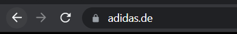
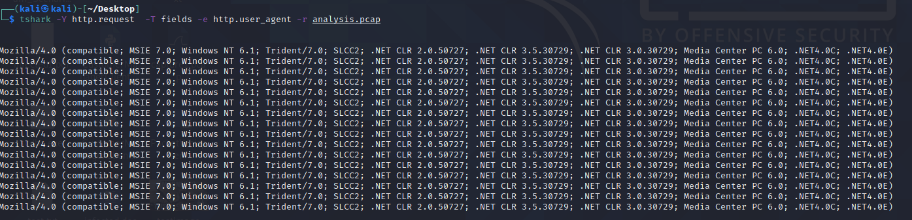

# Pyramid of Pain Walkthrough

**Author:** David Boyd<br>
**Date:** 2024-02-19

## Table of Contents

## Task 1: Introduction

pyramid of pain
: a pyramid that demonstrates that some IOCs (indicators of compromise) are
  more troubling to adversaries than others. This is because when those
  indicators are denied to an attacker, the loss of some will be more painful
  to them than the loss of others.<sup>[[1]][pop]</sup>

The [Pyramid of Pain][pop] concept is applied to cybersecurity solutions such as:

* [Cisco Security](https://gblogs.cisco.com/ca/2020/08/26/the-canadian-bacon-cisco-security-and-the-pyramid-of-pain/)
* [SentinelOne](https://www.sentinelone.com/blog/revisiting-the-pyramid-of-pain-leveraging-edr-data-to-improve-cyber-threat-intelligence/)
* [SOCRadar](https://socradar.io/re-examining-the-pyramid-of-pain-to-use-cyber-threat-intelligence-more-effectively/)


CTI (Cyber Threat Intelligence)
: is an evidence-based knowledge about adversaries, including their indicators,
  tactics, motivations, and actionable advice against them.

## Task 2: Hash Values (Trivial) - Blue

> It's easy to spot a malicious file if we have the hash in our arsenal.
>> :warning: Modifying files by even a single bit will produce a different hash
             value.

MD5 (Message Digest)
: a hash function that outputs 128-bit hash value. :x:*(Unsecure as of 2011)*

SHA-1 (Secure Hash Algorithm 1)
: a hash function that outputs an 160-bit hash value/40-digit hex.
  :x:*(Unsecure as of 2013)*

SHA-2 (Secure Hash Algorithm 2)
: a hash function that outputs varied-bit hash values. Most common is
  **SHA-256** which returns a 256-bit hash value/64-digit hex.

collision
: when two different files have the same hash value or digest.

Cybersecurity News Websites with Ransomware Reports:

* [The DFIR Report](https://thedfirreport.com/)
* [FireEye Threat Research Blogs](https://www.fireeye.com/blog/threat-research.html)

Online File-Hash Lookup Websites:

* [VirusTotal](https://www.virustotal.com/gui/)
* [Metadefender Cloud - OPSWAT](https://metadefender.opswat.com/?lang=en)

### Code: Change a File's Hash in PowerShell (Windows)

``` powershell
# Get the file hash in PowerShell on a Windows computer
Get-FileHash .\filename-01.msi - Algorithm MD5

# Append some rando shit
echo "AppendTheHash" >> .\filename-01.msi

# Get the modified file's new hash value
Get-FileHash .\filename-01.msi - Algorithm MD5
```

### Walkthrough: Task 2

#### Question 1

Analyse the report associated with the hash
"b8ef959a9176aef07fdca8705254a163b50b49a17217a4ff0107487f59d4a35d"
[here](https://assets.tryhackme.com/additional/pyramidofpain/t3-virustotal.pdf).
What is the filename of the sample?

<details>
  <summary>Expand for answer: </summary>
  <strong>Sales_Receipt 5606.xls</strong>
</details>

## Task 3: IP Addresses (Easy) - Dark Green

A **common defense tactic** is to block, drop, or deny inbound requests from IP
addresses on your parameter or external firewall. This tactic is often not
bulletproof as it’s trivial for an experienced adversary to recover simply by
using a new public IP address.

Fast Flux
: a DNS technique used by botnets to hide phishing, web proxying, malware
  delivery, and malware communication activities behind compromised hosts
  acting as proxies.  The **purpose** of using the Fast Flux network is to make
  the communication between malware and its C2 server challenging to be
  discovered by security professionals.<sup>[[2]][akamai]</sup>

***A Fast Flux network is having multiple IP address associated with a domain
name, which is constantly changing.***

* Read more [here](https://unit42.paloaltonetworks.com/fast-flux-101/).

### Walkthrough: Task 3

#### Question 1


Read the following
[report][t3_report] to answer this question. What is the first IP address the
malicious process (PID 1632) attempts to communicate with?

<details>
  <summary>Expand for answer: </summary>
  <strong>50.87.136.52</strong>
</details>

#### Question 2

Read the following [report][t3_report] to answer this question. What is the
first domain name the malicious process (PID 1632) attempts to communicate
with?

<details>
  <summary>Expand for answer: </summary>
    <strong>craftingalegacy.com</strong>
    </details>


## Task 4: Domain Names (Simple) - Light Green

> :warning: Many DNS providers have loose standards and provide APIs to make it
            even easier for the attacker to change the domain.

### Punycode Attack

> Punycode Defense: use proxy logs or web server logs to detect mailicious
                    domains.

Punycode attack
: a way of converting words that cannot be written in ASCII, into a Unicode
ASCII encoding.<sup>[[3]][punycode_def]</sup>

**Punycode Attack example redirects to `hxxp://xn--addad-o4a.de/`:**


**Original URL of `adidas.de`:**



### URL Shorteners

The following URL Shortening services can be used to generate malicious links:

* bit.ly
* goo.gl
* ow.ly
* s.id
* smarturl.it
* tiny.pl
* tinyurl.com
* x.co

:computer: Append a `+` to the end of the shortened URL to show the actual
           redirecting website. Ie *(not real URLs)*:

* hxxp://tinyur.com/cn6xznu+
* hxxp://bit.ly/vHle3Si+
* hxxp://goo.gl/sXloW2+

### Walkthrough: Task 4

#### Question 1

Go to this [report on app.any.run][t4_report] and provide the first suspicious
URL request you are seeing, you will be using this report to answer the
remaining questions of this task.

<details>
  <summary>Expand for answer: </summary>
    <strong>craftingalegacy.com</strong>
</details>

#### Question 2

What term refers to an address used to access websites?

<details>
  <summary>Expand for answer: </summary>
    <strong>Domain Name</strong>
    </details>

#### Question 3

What type of attack uses Unicode characters in the domain name to imitate the 
actual known domain?

<details>
  <summary>Expand for answer: </summary>
  <strong>Punycode attack</strong>
</details>

#### Question 4

Provide the redirected website for the shortened URL using a preview: 
[https://tinyurl.com/bw7t8p4u](https://tinyurl.com/bw7t8p4u)

<details>
  <summary>Expand for answer: </summary>
  <strong>https://tryhackme.com/</strong>
</details>

## Task 5: Host Artifacts (Annoying) - Yellow (Part 1)

host artifacts
: are the traces or observables that attackers leave on the system, such as 
  registry values, suspicious process execution, attack patterns or IOCs 
  (Indicators of Compromise), files dropped by malicious applications, or 
  anything exclusive to the current threat.

### Walkthrough: Task 5

#### Question 1

A security vendor has analyzed the malicious sample for us. Review the report 
[here][t5_report] to answer the following questions.

<details>
  <summary>Expand for answer: </summary>
  <strong>Click `Completed`</strong>
</details>

#### Question 2

A process named regidle.exe makes a POST request to an IP address based in the 
United States (US) on port 8080. What is the IP address?

<details>
  <summary>Expand for answer: </summary>
  <strong>96.135.101.6</strong>
</details>

#### Question 3

The actor drops a malicious executable (EXE). What is the name of this 
executable?

<details>
  <summary>Expand for answer: </summary>
  <strong>G-jugk.exe</strong>
</details>

#### Question 4

Look at this [report][t5_report2] by Virustotal. How many vendors determine 
this host to be malicious?

<details>
  <summary>Expand for answer: </summary>
  <strong>9</strong>
</details>

## Task 6: Network Artifacts (Annoying) - Yellow (Part 2)

> Can be detected in Wireshark PCAPs (file that contains the packet data of a 
  network) by using a network protocol analyzer such as TShark or exploring 
  IDS (Intrusion Detection System) logging from a source such as Snort.
>> Can block detected custom User-Agent strings.

network artifacts can be:

* A user-agent string
* C2 information
* URI patterns followed by the HTTP POST requests containing suspicious strings

#### Code: Filter User-Agent String via TShark

``` bash
# Filter out the User-Agent strings
tshark --Y http.request -T fields -e http.host -e http.user_agent -r netwfile.pcap
```

### Walkthrough: Task 6

#### Question 1



What browser uses the User-Agent string shown in the screenshot above?

<details>
  <summary>Expand for answer: </summary>
    <strong>Internet Explorer</strong>
</details>

#### Question 2

How many POST requests are in the screenshot from the PCAP file?

<details>
  <summary>Expand for answer: </summary>
    <strong>6</strong>
</details>

## Task 7: Tools (Challenging) - Orange

> AV signatures, detection rules, and YARA rules are great defenses at this
  stage.
>> Also [fuzzy hashing tools][ssdeep] help with similar/probable malicious file
  signature detection.

| Website                                         | Description                                                   |
|-------------------------------------------------|---------------------------------------------------------------|
| [MalwareBazaar][mb]                             | Provides access to samples, malicious feeds, and YARA results |
| [Malshare][ms]                                  | *(cont'd)* can be helpful with threat hunting and IR          |
| [SOC Prime Threat Detection Marketplace][sptdm] | Community-based detection rule database                       |
| [SSDeep Fuzzy Hashing Tool][ssdeep]             | Fuzzy hashing tool                                            |

fuzzy hashing
: helps perform similarity analysis - match two files with minor differences 
  based on the fuzzy has values.

## Walkthrough: Task 7

#### Question 1

Provide the method used to determine similarity between the files 

<details>
  <summary>Expand for answer: </summary>
  <strong>fuzzy hashing</strong>
</details>

#### Question 2

Provide the alternative name for fuzzy hashes without the abbreviation 

<details>
  <summary>Expand for answer: </summary>
  <strong>context triggered piecewise hashes</strong>

  *Visit the [SSDeep Official Website] to find the complete explanation for 
   fuzzy hashing!*
</details>

## Task 8: TTPs (Tough) - Red

> Use the [Mitre Att&CK Matrix][mitre] to see both an overview of TTPs and
  their real-world usages.

TTPs (Tactics, Techniques, & Procedures)
: are all of the steps taken by an adversary to achieve their goal, starting
  phishing attempts to persistence and data exfiltration.

### Walkthrough: Task 8

#### Question 1

Navigate to [ATT&CK Matrix webpage][mitre]. How many techniques fall under the
Exfiltration category?

<details>
  <summary>Expand for answer: </summary>
  <strong>9</strong>
</details>

#### Question 2

Chimera is a China-based hacking group that has been active since 2018. What 
is the name of the commercial, remote access tool they use for C2 beacons and 
data exfiltration?

<details>
  <summary>Expand for answer: </summary>
  <strong>Cobalt Stike</strong>

  *Search the [ATT&CK Matrix website][mitre] for Chimera.*
</details>

## Task 9: Practical: The Pyramid of Pain

> There is a known bug in this practical: there is no "correct" answer.

### Walkthrough: Task 9

#### Question 1

Complete the static site.

<details>
  <summary>Expand for answer: </summary>
  <strong>Click `Completed`</strong>
</details>


## Task 10: Conclusion

### Walkthrough: Task 10

#### Question 1

Read the above.

<details>
  <summary>Expand for answer: </summary>
  <strong>Click `Completed`</strong>
</details>

<!-- References -->
[pop]: https://www.attackiq.com/glossary/pyramid-of-pain/
[akamai]: https://blogs.akamai.com/2017/10/digging-deeper-an-in-depth-analysis-of-a-fast-flux-network-part-one.html
[t3_report]: https://assets.tryhackme.com/additional/pyramidofpain/task3-anyrun.pdf
[punycode_def]: https://www.wandera.com/punycode-attacks/
[t4_report]: https://app.any.run/tasks/a66178de-7596-4a05-945d-704dbf6b3b90
[t5_report]: https://assets.tryhackme.com/additional/pyramidofpain/task5-report.pdf
[t5_report2]: https://assets.tryhackme.com/additional/pyramidofpain/vtotal2.png
[mb]: https://bazaar.abuse.ch/
[ms]: https://malshare.com/
[sptdm]: https://tdm.socprime.com/
[ssdeep]: https://ssdeep-project.github.io/ssdeep/index.html
[pth]: https://www.beyondtrust.com/resources/glossary/pass-the-hash-pth-attack
[mitre]: https://attack.mitre.org/
