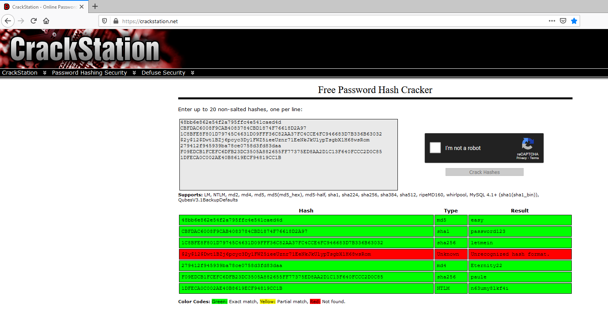
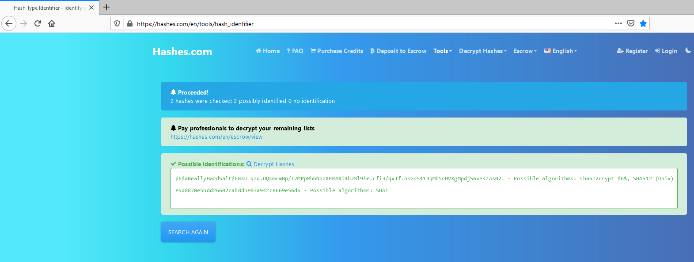

Crack the Hash
##############
:Author: David Boyd
:Date: 2020-11-08

Steps
*****

#. Crack Station
#. `Identify Hash <https://hashes.com/en/tools/hash_identifier>`_
#. Hashcat

Crack Station
*************
:Hashes NOT solved: Task1:#4, Task2:#3,#4  --> Refer to Hashcat section

Cracking hashes are much faster using `Crack Station
<https://crackstation.net>`_ as you don't need to specify each hashing
algorithm.  Note: The hashes must be non-salted.

Using Hashcat
*************

Hashcat Introduction
====================
:SYNTAX: hashcat <attack-mode> <hash-algo> <out.txt> <hashesFile> <wordlist> --potfile-disable
:Note: Disabling potfile allows outfile to be written as regular file
:!IMPORTANT: If using a hash that begins w/ "$", then use single quotes to surrounding the hash

1. The disadvantage to using hashcat, is that you'll have to know what type of
hash it is that your trying to crack.  You can identify hashes at `Hash
Identifier <https://hashes.com/en/tools/hash_identifier>`_.

Examples..

.. code-block:: Bash

	hashcat -a 0 -m 0 -o crackedpasswords.txt hashes.txt \
	  /usr/share/wordlists/rockyou.txt --potfile-disable

	# if only using the hash; THEN use single quotes
	hashcat -a 0 -m 0 -o crackedpasswords.txt \
	  'B1FCEFC6DFB23DC3505A882655FF77375ED8AA2D1C13F640FCCC2D0C85' \
	  /usr/share/wordlists/rockyou.txt --potfile-disable

Crack the Hash Questions
========================

[Task1] Level 1
---------------

4. $2y$12$Dwt1BZj6pcyc3Dy1FWZ5ieeUznr71EeNkJkUlypTsgbX1H68wsRom

	- bleh

Note: Took an hour and forty nine fucking minutes.  This is what happens when
`Crack Station <https://crackstation.net>`_ doesn't solve it for you... wtf,
man.

.. code-block:: Bash

	hashcat -m 3200 -O question4.hash /usr/share/wordlists/rockyou.txt
		> hashcat (v6.1.1) starting...

		> Kernel /usr/share/hashcat/OpenCL/m03200-optimized.cl:
		> Optimized kernel requested but not needed - falling back to pure kernel

		> OpenCL API (OpenCL 1.2 pocl 1.5, None+Asserts, LLVM 9.0.1, RELOC, SLEEF,
		> DISTRO, POCL_DEBUG) - Platform #1 [The pocl project]
		> =============================================================================================================================
		> * Device #1: pthread-Intel(R) ***
		> * (4096 MB allocatable), 8MCU

		> Kernel /usr/share/hashcat/OpenCL/m03200-optimized.cl:
		> Optimized kernel requested but not needed - falling back to pure kernel

		> Minimum password length supported by kernel: 0
		> Maximum password length supported by kernel: 72

		> Hashes: 1 digests; 1 unique digests, 1 unique salts
		> Bitmaps: 16 bits, 65536 entries, 0x0000ffff mask, 262144 bytes, 5/13 rotates
		> Rules: 1

		> Applicable optimizers applied:
		> * Zero-Byte
		> * Single-Hash
		> * Single-Salt

		> Watchdog: Hardware monitoring interface not found on your system.
		> Watchdog: Temperature abort trigger disabled.

		> Host memory required for this attack: 66 MB

		> Dictionary cache hit:
		> * Filename..: /usr/share/wordlists/rockyou.txt
		> * Passwords.: 14344385
		> * Bytes.....: 139921507
		> * Keyspace..: 14344385

		> $2y$12$Dwt1BZj6pcyc3Dy1FWZ5ieeUznr71EeNkJkUlypTsgbX1H68wsRom:bleh

		> Session..........: hashcat
		> Status...........: Cracked
		> Hash.Name........: bcrypt $2*$, Blowfish (Unix)
		> Hash.Target......: $2y$12$Dwt1BZj6pcyc3Dy1FWZ5ieeUznr71EeNkJkUlypTsgbX...8wsRom
		> Time.Started.....: Sun Nov  8 17:00:06 2020 (1 hour, 49 mins)
		> Time.Estimated...: Sun Nov  8 18:49:22 2020 (0 secs)
		> Guess.Base.......: File (/usr/share/wordlists/rockyou.txt)
		> Guess.Queue......: 1/1 (100.00%)
		> Speed.#1.........:       27 H/s (8.59ms) @ Accel:2 Loops:64 Thr:1 Vec:8
		> Recovered........: 1/1 (100.00%) Digests
		> Progress.........: 173936/14344385 (1.21%)
		> Rejected.........: 0/173936 (0.00%)
		> Restore.Point....: 173920/14344385 (1.21%)
		> Restore.Sub.#1...: Salt:0 Amplifier:0-1 Iteration:4032-4096
		> Candidates.#1....: blomster -> blanca2

		> Started: Sun Nov  8 17:00:05 2020
		> Stopped: Sun Nov  8 18:49:24 2020

[Task 2] Level 2
----------------

3.

+--------+-----------------------------------------------------------------------------------------------------------+
| Hash   | $6$aReallyHardSalt$6WKUTqzq.UQQmrm0p/T7MPpMbGNnzXPMAXi4bJMl9be.cfi3/qxIf.hsGpS41BqMhSrHVXgMpdjS6xeKZAs02. |
+--------+-----------------------------------------------------------------------------------------------------------+
| Salt   | aReallyHardSalt                                                                                           |
+--------+-----------------------------------------------------------------------------------------------------------+
| Rounds | 5                                                                                                         |
+--------+-----------------------------------------------------------------------------------------------------------+

	- waka99

Copy and paste hash into `Hash Identifer
<https://hases.com/en/tools/hash_identifer>`_.  Then check out possible
alogorithms.

.. code-block:: Bash

	hashcat -m 1800 \
	  '$6$aReallyHardSalt$6WKUTqzq.UQQmrm0p/T7MPpMbGNnzXPMAXi4bJMl9be.cfi3/qxIf.hsGpS41BqMhSrHVXgMpdjS6xeKZAs02.' \
	  /usr/share/wordlists/rockyou.txt
		> hashcat (v6.1.1) starting...
		>
		> OpenCL API (OpenCL 1.2 pocl 1.5, None+Asserts, LLVM 9.0.1, RELOC, SLEEF,
		> DISTRO, POCL_DEBUG) - Platform #1 [The pocl project]
		> =============================================================================================================================
		> * Device #1: pthread-Intel(R) Core(TM) ***
		> * (4096 MB allocatable), 8MCU
		>
		> Minimum password length supported by kernel: 0
		> Maximum password length supported by kernel: 256
		>
		> Hashes: 1 digests; 1 unique digests, 1 unique salts
		> Bitmaps: 16 bits, 65536 entries, 0x0000ffff mask, 262144 bytes, 5/13 rotates
		> Rules: 1
		>
		> Applicable optimizers applied:
		> * Zero-Byte
		> * Single-Hash
		> * Single-Salt
		> * Uses-64-Bit
		>
		> ATTENTION! Pure (unoptimized) backend kernels selected.
		> Using pure kernels enables cracking longer passwords but for the price of
		> drastically reduced performance.
		> If you want to switch to optimized backend kernels, append -O to your
		> commandline.
		> See the above message to find out about the exact limits.
		>
		> Watchdog: Hardware monitoring interface not found on your system.
		> Watchdog: Temperature abort trigger disabled.
		>
		> Host memory required for this attack: 66 MB
		>
		> Dictionary cache hit:
		> * Filename..: /usr/share/wordlists/rockyou.txt
		> * Passwords.: 14344385
		> * Bytes.....: 139921507
		> * Keyspace..: 14344385
		>
		> $6$aReallyHardSalt$6WKUTqzq.UQQmrm0p/T7MPpMbGNnzXPMAXi4bJMl9be.cfi3/qxIf.hsGpS41BqMhSrHVXgMpdjS6xeKZAs02.:waka99
		>
		> Session..........: hashcat
		> Status...........: Cracked
		> Hash.Name........: sha512crypt $6$, SHA512 (Unix)
		> Hash.Target......: $6$aReallyHardSalt$6WKUTqzq.UQQmrm0p/T7MPpMbGNnzXPM...ZAs02.
		> Time.Started.....: Sun Nov  8 19:56:26 2020 (33 mins, 43 secs)
		> Time.Estimated...: Sun Nov  8 20:30:09 2020 (0 secs)
		> Guess.Base.......: File (/usr/share/wordlists/rockyou.txt)
		> Guess.Queue......: 1/1 (100.00%)
		> Speed.#1.........:     1320 H/s (9.23ms) @ Accel:64 Loops:128 Thr:1 Vec:4
		> Recovered........: 1/1 (100.00%) Digests
		> Progress.........: 2832384/14344385 (19.75%)
		> Rejected.........: 0/2832384 (0.00%)
		> Restore.Point....: 2831872/14344385 (19.74%)
		> Restore.Sub.#1...: Salt:0 Amplifier:0-1 Iteration:4992-5000
		> Candidates.#1....: wakaguma -> waiteti
		>
		> Started: Sun Nov  8 19:56:20 2020
		> Stopped: Sun Nov  8 20:30:11 2020

4.

+------+------------------------------------------+
| Hash | e5d8870e5bdd26602cab8dbe07a942c8669e56d6 |
+------+------------------------------------------+
| Salt | tryhackme                                |
+------+------------------------------------------+

	- 481616481616

From `Hash Identifier <https://hashes.com/en/tools/hash_identifier>`_, we know
that the hash is a SHA1.  Therfore we can easily find the hashcat's reference
number by using grep.

.. code-block:: Bash

	# Find Hashcat's SHA1 reference number
	hashcat --help | grep -i sha1
		> 110

	# Crack the hash
	hashcat -m 110 'e5d8870e5bdd26602cab8dbe07a942c8669e56d6:tryhackme' \
	  /usr/ share/wordlists/rockyou.txt
		> INFO: All hashes found in potfile! Use --show to display them.

	# If password has already been cracked; THEN
	#  Hashcat stores its passwords in its potfile.
	hashcat -m 110 --show \
	  'e5d8870e5bdd26602cab8dbe07a942c8669e56d6:tryhackme'
		> e5d8870e5bdd26602cab8dbe07a942c8669e56d6:tryhackme:481616481616

